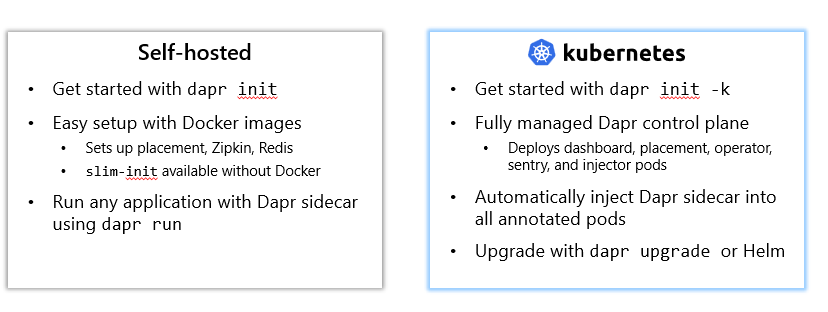

# Dapr installation

## Dapr hosting environments

Dapr can be deployed to any of the following hosting environments:
- Self-hosted
- Kubernetes

The diagram below shows the different hosting environments:



## Installing locally

To install Dapr locally, go to the [Dapr website](https://docs.dapr.io/getting-started/install-dapr-cli/) and follow the instructions:
- Download the Dapr CLI
- Use `dapr init` to configure Dapr on your local system

To install Dapr CLI on Linux, simply use the following command (will prompt for your password):

`wget -q https://raw.githubusercontent.com/dapr/cli/master/install/install.sh -O - | /bin/bash`

On Windows, use:

`powershell -Command "iwr -useb https://raw.githubusercontent.com/dapr/cli/master/install/install.ps1 | iex"`

Next, run the following command to initialize Dapr:

`dapr init`

Dapr init does the following:
- Creates the .dapr folder in your home directory
- Creates a `config.yaml` file in the .dapr folder that enables tracing with zipkin
- Creates a components folder in the .dapr folder that contains two Dapr components:
    - pubsub.yaml: allows you to use pubsub on your local machine with Redis (Redis is installed as a container)
    - statestore.yaml: allows you to work with state on your local machine with Redis (same Redis container)
- Creates three containers (Docker is required):
    - Redis
    - Zipkin
    - Placement (local actor development)

This is the folder structure:

```
.
├── bin
│   ├── daprd
│   ├── dashboard
│   └── web
├── components
│   ├── pubsub.yaml
│   └── statestore.yaml
└── config.yaml
```

To verify the Dapr version use `dapr --version`. You will see a CLI version and a Runtime version (for the sidecar):

```
CLI version: 1.4.0
Runtime version: 1.4.3
```

To verify the containers are running, use `docker ps` or `docker container ls`. You will see the following:

```
CONTAINER ID   IMAGE               COMMAND                  CREATED
b84cf7a244c4   daprio/dapr:1.4.3   "./placement"            22 hours ago  
d3fc91c46065   redis               "docker-entrypoint.s…"   22 hours ago   
cfb2f6139902   openzipkin/zipkin   "start-zipkin"           22 hours ago
```	

You can now use `dapr dashboard` to start the Dapr dashboard on your local machine. By default, it will run on port 8080. Use the dashboard to view the status of your Dapr components, running applications, and other Dapr information.

## Installing on Kubernetes

To install Dapr on Kubernetes, you can use the Dapr CLI:

```
dapr init --kubernetes --wait
```

Afterwards, use `dapr status -k` to check Dapr status on Kubernetes. You should see:

```
NAME                   NAMESPACE    HEALTHY  STATUS   REPLICAS  VERSION  AGE  CREATED
dapr-placement-server  dapr-system  True     Running  1         1.4.3    1h   2021-10-21 14:07.37
dapr-dashboard         dapr-system  True     Running  1         0.8.0    1h   2021-10-21 14:07.37
dapr-operator          dapr-system  True     Running  1         1.4.3    1h   2021-10-21 14:07.37
dapr-sidecar-injector  dapr-system  True     Running  1         1.4.3    1h   2021-10-21 14:07.37
dapr-sentry            dapr-system  True     Running  1         1.4.3    1h   2021-10-21 14:07.37
```

You will notice that Redis and Zipkin are not part of Dapr on Kubernetes. On your local machine, they are created for convenience. On Kubernetes, you have to deploy these services manually. For instance, you could deploy Redis on Kubernetes or use Azure Redis Cache. Alternatively, you could decide to not use Redis and use Cosmos DB for state management and Azure Service Bus for pubsub.

Dapr on Kubernetes does not come with preconfigured components. Just as there is no Redis or Zipkin deployed, there are no components for state management or pubsub with Redis. You will need to define these components yourself via YAML manifests. You can check components on Kubernetes with `dapr components -k`.

You can also check components and other information about Dapr on Kubernetes with the dashboard:

```
dapr dashboard -k
```

Then navigate to https://localhost:8080 to see the dashboard. There should be no components and a default configuration called `daprsystem` that does not configure tracing. Naturally, this requires a working connection to your Kubernetes cluster with `kubectl`.

### Using Dapr on your local machine

You can run Dapr without an application and still test the components on your local machine. To do this, you can use the `dapr run` command:

`dapr run --app-id myapp --dapr-http-port 3000`

This runs the Dapr sidecar without an app. In the output, you will see Dapr complain about that but the sidecar still runs.

Because we did not specify our own components (e.g. Cosmos DB for state), we can use the default components that Dapr created for us. The state store component is simply called `statestore`. Dapr will accept incoming requests to the port we specified (3000) and if we format the request properly for state management, we can write and read state from Redis. For example:

`curl -X POST -H "Content-Type: application/json" -d '[{ "key": "course", "value": "K8S Deep Dive"}]' http://localhost:3000/v1.0/state/statestore`

To retrieve the saved state, use the following command:

`curl http://localhost:3000/v1.0/state/statestore/course`

The course information is stored in Redis as key/value pairs. Let's start `redis-cli` in the Redis container. With `redis-cli` we can retrieve the data from Redis and see that it is stored as a JSON object:

`docker exec -it dapr_redis redis-cli`

In `redis-cli`, run the following command: `keys *`

You will see that the key is `course` but prefixed with the Dapr app id (myapp) and ||:

```
127.0.0.1:6379> keys *
1) "myapp||course"
```

To see the value of the key, run `hgetall "myapp||course"`. The result:

```
1) "data"
2) "\"K8S Deep Dive\""
3) "version"
4) "1"
```

You have now successfully stored and retrieved state on your local machine. The above is a simple example of how to use Dapr on your local machine and you can use the same approach to test other components. In reality however, you will call the components from your application using either the HTTP or gRPC APIs.

Further exploration:
- [Service invocation](../01-service-invocation/README.md)