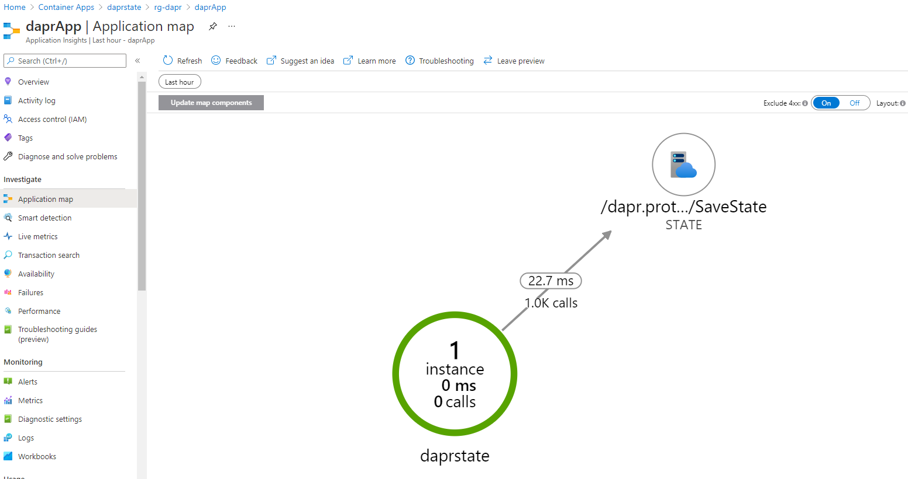

# Dapr with Azure Container Apps (preview)

## Install Container Apps extension

```
az extension add \
  --source https://workerappscliextension.blob.core.windows.net/azure-cli-extension/containerapp-0.2.0-py2.py3-none-any.whl
```

## Deploy Container Apps Environment

Create a resource group:

```
az group create --name rg-dapr --location westeurope
```

Create a Log Analytics workspace:

```
az monitor log-analytics workspace create \
  --resource-group rg-dapr \
  --workspace-name dapr-logs
```

Retrieve workspace client ID and key:

```
LOG_ANALYTICS_WORKSPACE_CLIENT_ID=`az monitor log-analytics workspace show --query customerId -g rg-dapr -n dapr-logs --out tsv`
LOG_ANALYTICS_WORKSPACE_CLIENT_SECRET=`az monitor log-analytics workspace get-shared-keys --query primarySharedKey -g rg-dapr -n dapr-logs --out tsv`
LOG_ANALYTICS_WORKSPACE_ID=`az monitor log-analytics workspace show --query id -g rg-dapr -n dapr-logs --out tsv`
```

If you want to use App Insights, use the following command:

```
az extension add -n application-insights
az monitor app-insights component create --app daprApp --location northeurope --kind web -g rg-dapr --workspace $LOG_ANALYTICS_WORKSPACE_ID
KEY=`az monitor app-insights component show --app daprApp -g rg-dapr --query instrumentationKey --out tsv`
```

Create the Azure Container Apps environment:

```
az containerapp env create \
  --name dapr-ca \
  --resource-group rg-dapr \
  --logs-workspace-id $LOG_ANALYTICS_WORKSPACE_CLIENT_ID \
  --logs-workspace-key $LOG_ANALYTICS_WORKSPACE_CLIENT_SECRET \
  --location northeurope
```

Optionally add instrumentation key to the environment with `--instrumentation-key $KEY`

If you want to use the state example, skip the next steps until you arrive at **Saving State**.

## Create Azure Service Bus


```bash
namespaceName=MyNameSpace$RANDOM
az servicebus namespace create --resource-group rg-dapr --name $namespaceName --location northeurope
az servicebus topic create --resource-group rg-dapr --namespace-name $namespaceName --name sampleTopic
az servicebus namespace authorization-rule keys list --resource-group rg-dapr --namespace-name $namespaceName --name RootManageSharedAccessKey --query primaryConnectionString --output tsv
```

## Create a components.yaml file

```yaml
# components.yaml for Azure Service Bus
- name: pubsub
  type: pubsub.azure.servicebus
  version: v1
  metadata:
  - name: connectionString
    value: Endpoint=sb://dapr-pubsub.servicebus.windows.net/;SharedAccessKeyName=RootManageSharedAccessKey;SharedAccessKey=YOUR_KEY
```

**Note:** we do not make use of secrets here, but you can use secrets to store your connection strings

## Create the publisher container app

```
az containerapp create \
  --name daprpub \
  --resource-group rg-dapr \
  --environment dapr-ca \
  --image gbaeke/dapr-pub:1.0.0 \
  --min-replicas 1 \
  --max-replicas 1 \
  --enable-dapr \
  --dapr-app-id daprpub \
  --dapr-components ./components.yaml
```

## Create the subscriber container app

```
az containerapp create \
  --name daprsub \
  --resource-group rg-dapr \
  --environment dapr-ca \
  --image gbaeke/dapr-sub:1.0.0 \
  --min-replicas 2 \
  --max-replicas 5 \
  --enable-dapr \
  --dapr-app-port 3000 \
  --dapr-app-id daprsub \
  --dapr-components ./components.yaml
```

## Look at the logs

```
az monitor log-analytics query \
  --workspace $LOG_ANALYTICS_WORKSPACE_CLIENT_ID \
  --analytics-query "ContainerAppConsoleLogs_CL | where ContainerAppName_s == 'daprsub' | project ContainerAppName_s, Log_s, TimeGenerated | take 5" \
  --out table
```

# Saving state

When you have deployed the Container Apps environment above, create a Cosmos DB account in the same resource group: rg-dapr.

```
uniqueId=$RANDOM
az cosmosdb create \
  --name dapr-cosmosdb-$uniqueId \
  --resource-group rg-dapr \
  --locations regionName='westeurope'
```

Next, create a SQL API database:

```
az cosmosdb sql database create \
    -a dapr-cosmosdb-$uniqueId \
    -g rg-dapr \
    -n dapr-db
```

Then create a SQL API container:

```
az cosmosdb sql container create \
    -a dapr-cosmosdb-$uniqueId \
    -g rg-dapr \
    -d dapr-db \
    -n statestore \
    -p '/partitionKey' \
    --throughput 400
```

Create a state store component for Cosmos DB:

```yaml
- name: statestore
  type: state.azure.cosmosdb
  version: v1
  metadata:
    - name: url
      value: YOURURL
    - name: masterkey
      value: YOURMASTERKEY
    - name: database
      value: YOURDB
    - name: collection
      value: YOURCOLLECTION
```

Now create the container app that can write to Cosmos DB:

```
az containerapp create \
  --name daprstate \
  --resource-group rg-dapr \
  --environment dapr-ca \
  --image gbaeke/dapr-state:1.0.0 \
  --min-replicas 1 \
  --max-replicas 1 \
  --enable-dapr \
  --dapr-app-id daprstate \
  --dapr-components ./components-cosmosdb.yaml \
  --target-port 8080 \
  --ingress external
```

**Note:** you can set a secret with the --secrets flag. E.g. `--secrets cosmosdb='cosmosdbkey`

Now try to POST to the /state endpoint of the container app:

```
curl -v -XPOST -H "Content-type: application/json" -d '{ "key": "cool","data": "somedata"}' 'https://daprstate.jollymoss-4c97b64b.northeurope.azurecontainerapps.io/state'
```

This should give the following response:

```
Error writing to statestore: error saving state: rpc error: code = Internal desc = failed saving state in state store statestore: BadRequest, ConsistencyLevel Strong specified in the request is invalid when service is configured with consistency level Session. Ensure the request consistency level is not stronger than the service consistency level.
```

This is expected. The code in our container uses strong consistency, but the Cosmos DB service is configured with session consistency. Update the Cosmos DB service to use strong consistency and give it some time. When you try again, and you do not get an error, go to Cosmos DB data explorer and find key **daprstate||cool**. The document will resemble the following:

```json
{
    "id": "daprstate||cool",
    "value": "c29tZWRhdGE=",
    "isBinary": true,
    "partitionKey": "daprstate||cool",
    "_rid": "+NBgAIpRabEBAAAAAAAAAA==",
    "_self": "dbs/+NBgAA==/colls/+NBgAIpRabE=/docs/+NBgAIpRabEBAAAAAAAAAA==/",
    "_etag": "\"8600584c-0000-0d00-0000-6181c76e0000\"",
    "_attachments": "attachments/",
    "_ts": 1635895150
}
```

Note the value is base64 encoded. This is because Cosmos DB stores binary data as base64 encoded strings and the Dapr SDK uses byte arrays.

If you would run the same code with Redis as the backend, Redis would store the data as the string "somedata".

# Application Map

If you enable Application Insights, you can use the Application Map to see the container apps in the Azure portal:

