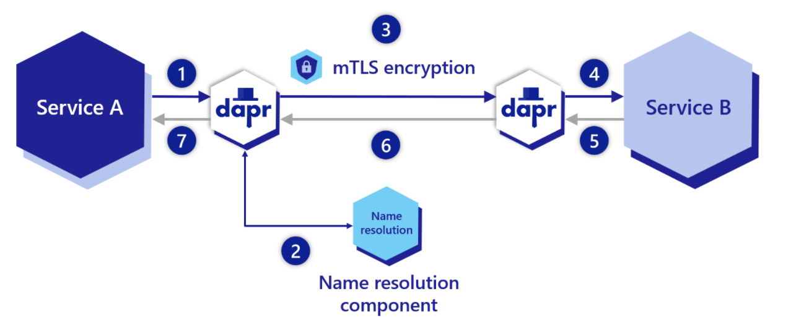

# Service Invocation

## Overview

**API reference:** [dapr docs](https://docs.dapr.io/reference/api/service_invocation_api/)

When multiple services need to communicate, there are several challenges:
- how do you discover services and invoke their methods?
- how do you secure communication between services?
- how do you handle errors?
- how do you do tracing?

Dapr has an answer to all of these questions:
- every service has an app-id, which is a unique identifier for the service
- Dapr has several supported name resolution components to resolve the app-id to an address on the network
    - self-hosted: mDNS is configured automatically; mDNS is **not available** on a Microsoft Azure virtual network because it uses IP multicast queries; see [mDNS](https://en.wikipedia.org/wiki/Multicast_DNS)
    - Kubernetes: uses Kubernetes DNS to resolve the app-id to an address on the network
- When a service (e.g. ServiceA) needs to call a method of another service (e.g. ServiceB), it can use the invoke API
    - Service does a call to the Dapr sidecar: `http://localhost:daprPort/v1.0/invoke/ServiceB/MethodName`
    - ServiceA sidecar resolves name of ServiceB to an address on the network
    - ServiceA sidecar sends the request to ServiceB sidecar over a secured connection (mTLS)
    - ServiceB sidecar calls the method on the service and returns the result



> ⚠️ Services in the same Kubernetes namespace can communicate with each other using the Dapr sidecar and just the service names (e.g. /v1.0/invoke/ServiceB/MethodName). If ServiceB is in a different namespace, use /v1.0/invoke/ServiceB.YourNamespace/MethodName.

----------

## Access control

If you want to limit the services that can call another service, you can use access control. Access control is configured in a Configuration resource.To create a configuration, you need to understand the following concepts:

- TrustDomain: a logical group; every application is assigned a trust domain; the default trust domain is `public`
- App Identity: all applications get a SPIFFE ID in the following format: `spiffe://trustdomain/ns/namespace/appid`

The following configuration denies access to all applications except when trust domain is `public` and app-id is `app1` in `default` namespace:

```yaml
apiVersion: dapr.io/v1alpha1
kind: Configuration
metadata:
  name: appconfig
spec:
  accessControl:
    defaultAction: deny
    trustDomain: "public"
    policies:
    - appId: app1
      defaultAction: allow
      trustDomain: 'public'
      namespace: "default"
```

More examples can be found [here](https://docs.dapr.io/operations/configuration/invoke-allowlist/#example-scenarios).

Note that when you use access control, you need to associate your application with a configuration via the `dapr.io/config` annotation. For example:

```yaml
apiVersion: apps/v1
kind: Deployment
metadata:
  name: pythonapp
  namespace: default
  labels:
    app: python
spec:
  replicas: 1
  selector:
    matchLabels:
      app: python
  template:
    metadata:
      labels:
        app: python
      annotations:
        dapr.io/enabled: "true"
        dapr.io/app-id: "pythonapp"
        dapr.io/config: "pythonappconfig"
    spec:
      containers:
      - name: python
        image: dapriosamples/hello-k8s-python:edge
```

Above, `pythonappconfig` refers to a Dapr configuration resource.

----------

## Retries

Service invocation has automatic retries with backoff time periods. Per call retries are performed with a backoff interval of 1 second, up to a threshold of 3 times.

Check [here](https://github.com/dapr/dapr/blob/1cbf67f8a5da0bb5be4e3a123632c17ebb173f4e/pkg/retry/retry.go) and [here](https://github.com/dapr/dapr/blob/143f90a8bb624244ca4ead3cc3b906fb73527fce/pkg/messaging/direct_messaging.go#L131) for more details.

----------

## Tracing

Calls between applications are traced. You need to send these traces to a solution like Zipkin or Application Insights. See [observability](https://docs.dapr.io/concepts/observability-concept/) for more details.

