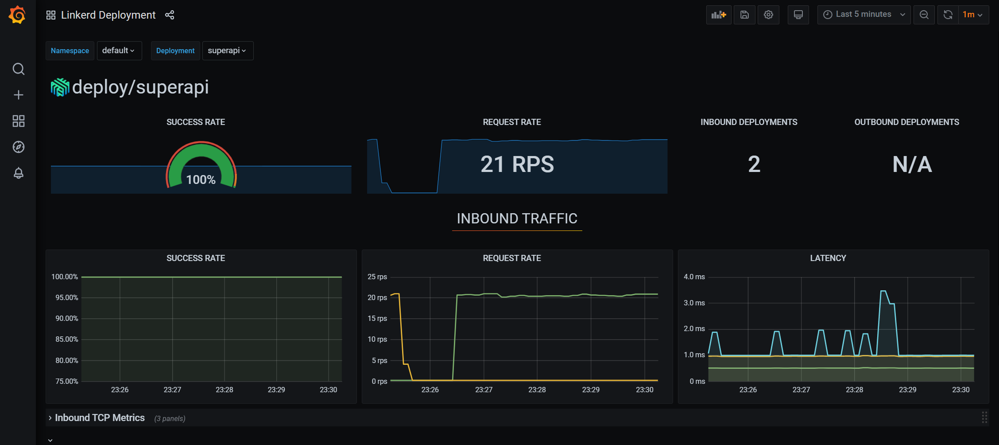
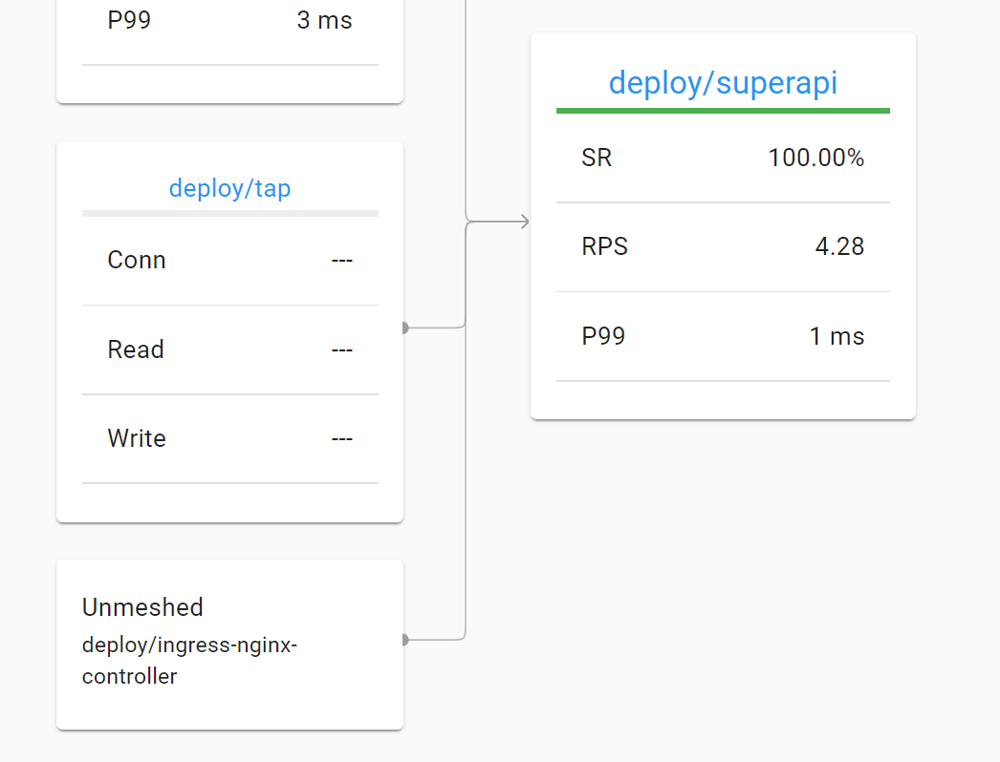

# Implementing a service mesh

## Install the Linkerd CLI

Install the Linkerd CLI with Homebrew for MacOS or Linux:

```
brew install linkerd
```

If you do not use Homebrew, install with curl:

```
curl -fsL https://run.linkerd.io/install | sh
```

⚠️ Important: on Windows, download the executable from GitHub at https://github.com/linkerd/linkerd2/releases/ or use `choco install linkerd2` if you use Chocolatey.

⚠️ Important: in production you should use the Helm chart instead of the CLI. See https://linkerd.io/2.11/tasks/install-helm/ for more information.


## Install Linkerd on your cluster

Use the Linkerd CLI to run a pre check, install Linkerd and check for success:

```
linkerd check --pre
linkerd install | kubectl apply -f -
linkerd check
```

Linkerd is now installed in the `linkerd` namespace. Note that linkerd CLI has automatically generated a root certificate with a one year validity. In production, and when you install with Helm, this certificate should be created by you, preferably with a longer lifetime. See https://linkerd.io/2.11/tasks/generate-certificates/. The documentation uses `step` to generate a root certificate and an intermediate certificate.

## Install extensions

Linkerd comes with the `viz` extension. It installs a metric stack on your cluster with Prometheus and Grafana. Install the extension with:

```
linkerd viz install | kubectl apply -f -
linkerd viz check
```

After installation, run `linkerd viz dashboard`

⚠️ This might trigger AKS scale out. The most likely cause is that you hit the pod limit of 30. Give the cluster some time to scale out.

After the installation, launch the Linkerd dashboard with `linkerd viz dashboard` and view the dashboard via the localhost URL.

Also install the buoyant cloud extension (optional though):

```
curl -sL buoyant.cloud/install | sh
export PATH=$PATH:/home/gbaeke/.linkerd2/bin
linkerd buoyant install | kubectl apply -f -
```
💡 Note: the buoyant extension requires you to setup a connection to buoyant cloud (the makers of linkerd); during the installation, you will be prompted to enter your credentials or authenticate with GitHub or a Google account

To view the dashboard on buoyant cloud, use:

```
linkerd buoyant dashboard
```

💡 Note: at the time of writing, the Buoyant Cloud was in public beta (October 2021)

## Install a meshed app

In the `manifests` folder, you will find a deployment and service for a simple app. Before we deploy the app, we need to ensure the linkerd proxy is injected.

👉 Perform the following steps:
- in `manifests` open `deployment.yaml`
- add the following annotation: `linkerd.io/inject: enabled`
    - ensure the annotation is added to pods ⚠️
- deploy the manifests with kustomize: `kubectl apply -k .`

Verify that the `superapi` pod has 2 containers (actually 3):
- the completed `linkerd-init` container
- the `linkerd-proxy` container
- the `superapi` container that runs our app

All traffic to and from the `superapi` container is proxied by the `linkerd-proxy` container.

## Check the Linkerd dashboard

If the dashboard is not running anymore, run `linkerd viz dashboard` and open the localhost URL.

👉 Perform the following steps:
- locate the `superapi` deployment in the default namespace and check that it is meshed
- click the meshed pod and verify that it has incoming connections from both the buoyant cloud metrics collector and the Prometheus metrics collector

Keep the dashboard open.

## Add a debug pod

The manifests folder contains `debug-pod.yaml`.

👉 Perform the following steps:
- modify the `debug-pod.yaml` to add the `linkerd.io/inject: enabled` annotation
- deploy the debug pod
- get a shell to the debug pod; it uses the `sh` shell
    - you will need to specify the container to shell into
- generate some traffic with: `while true; do curl http://superapi; done`
- check the traffic to `superapi`
    - check the success rate of the requests (SR)
    - check the requests per second (RPS)
    - check the latency at P99 (99th percentile) (P99)
- next to the `superapi` deployment, click the little `grafana` icon; you should see a Grafana dashboard for the deployment with traffic information as shown below



## Service profile

You can generate a service profile from the OpenAPI spec of `super-api`:

```
linkerd profile --open-api <swagger file> <servicename>
```

For example:

```
wget https://raw.githubusercontent.com/gbaeke/super-api/main/pkg/api/docs/swagger.json
linkerd profile --open-api swagger.json superapi
```

This outputs the following profile:

```yaml
apiVersion: linkerd.io/v1alpha2
kind: ServiceProfile
metadata:
  creationTimestamp: null
  name: superapi.sampleapp.svc.cluster.local
  namespace: linkerdapp
spec:
  routes:
  - condition:
      method: GET
      pathRegex: /healthz
    name: GET /healthz
    responseClasses:
    - condition:
        status:
          max: 200
          min: 200
  - condition:
      method: GET
      pathRegex: /readyz
    name: GET /readyz
    responseClasses:
    - condition:
        status:
          max: 200
          min: 200
```

See https://linkerd.io/2.10/reference/service-profiles/ for the service profiles reference.

Use the linkerd dashboard to view the routes specified in the service profile.

## Add ingress

Use `ingress.yaml` to add an ingress. Update the ingress class for your ingress and update the IP address in the nip.io domain.

⚠️ If no Ingress Controller is installed, see [Ingress](ingress/README.md) and only use the install instructions.

Generate some traffic with a tool look `ddosify` (see https://github.com/ddosify/ddosify)

For example:

```
ddosify -t http://linkerd.20.73.120.87.nip.io/
```

If your ingress is unmeshed, the Linkerd dashboard shows the traffic as unmeshed. You will see source IP addresses of your ingress. If you use Application Gateway, you will see source IP addresses of the Application Gateway. If you use an in-cluster Ingress Controller like nging, you will see the nginx deployment.



## Using the CLI

Use linkerd viz top:

```
linkerd viz top deployment/superapi --namespace default
```

Use linkerd viz routes:

```
linkerd routes deployment/superapi --namespace default
```

Use linkerd viz tap to see the traffic to the service in realtime:

```
linkerd viz tap deployment/superapi --namespace default
```

Use linkerd viz edges:

```
linkerd viz edges po -n default
```
