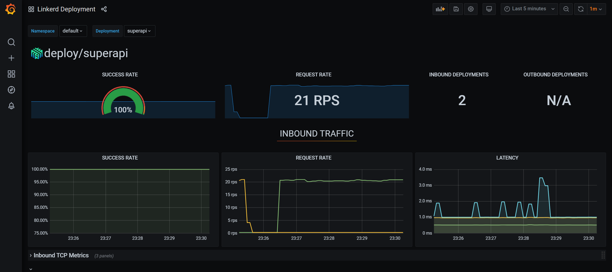

# Implementing a service mesh

## Install the Linkerd CLI

Install the Linkerd CLI with Homebrew for MacOS or Linux:

```
brew install linkerd
```

If you do not use Homebrew, install with curl:

```
curl -fsL https://run.linkerd.io/install | sh
```

⚠️ Important: on Windows, download the executable from GitHub at https://github.com/linkerd/linkerd2/releases/ or use `choco install linkerd2` if you use Chocolatey.

⚠️ Important: in production you should use the Helm chart instead of the CLI. See https://linkerd.io/2.11/tasks/install-helm/ for more information.


## Install Linkerd on your cluster

Use the Linkerd CLI to run a pre check, install Linkerd and check for success:

```
linkerd check --pre
linkerd install | kubectl apply -f -
linkerd check
```

Linkerd is now installed in the `linkerd` namespace.

## Install extensions

Linkerd comes with the `viz` extension. It installs a metric stack on your cluster with Prometheus and Grafana. Install the extension with:

```
linkerd viz install | kubectl apply -f -
```

After the installation, launch the Linkerd dashboard with `linkerd viz dashboard` and view the dashboard via the localhost URL.

Also install the buoyant cloud extension (optional though):

```
curl -sL buoyant.cloud/install | sh
export PATH=$PATH:/home/gbaeke/.linkerd2/bin
linkerd buoyant install | kubectl apply -f -
```
💡 Note: the buoyant extension requires you to setup a connection to buoyant cloud (the makers of linkerd); during the installation, you will be prompted to enter your credentials or authenticate with GitHub or a Google account

To view the dashboard on buoyant cloud, use:

```
linkerd buoyant dashboard
```

💡 Note: at the time of writing, the Buoyant Cloud was in public beta (October 2021)

## Install a meshed app

In the `manifests` folder, you will find a deployment and service for a simple app. Before we deploy the app, we need to ensure the linkerd proxy is injected.

👉 Perform the following steps:
- in `manifests` open `deployment.yaml`
- add the following annotation: `linkerd.io/inject: enabled`
    - ensure the annotation is added to pods ⚠️
- deploy the manifests with kustomize: `kubectl apply -k .`

Verify that the `superapi` pod has 2 containers (actually 3):
- the completed `linkerd-init` container
- the `linkerd-proxy` container
- the `superapi` container that runs our app

All traffic to and from the `superapi` container is proxied by the `linkerd-proxy` container.

## Check the Linkerd dashboard

If the dashboard is not running anymore, run `linkerd viz dashboard` and open the localhost URL.

👉 Perform the following steps:
- locate the `superapi` deployment in the default namespace and check that it is meshed
- click the meshed pod and verify that it has incoming connections from both the buoyant cloud metrics collector and the Prometheus metrics collector

Keep the dashboard open.

## Add a debug pod

The manifests folder contains `debug-pod.yaml`.

👉 Perform the following steps:
- modify the `debug-pod.yaml` to add the `linkerd.io/inject: enabled` annotation
- deploy the debug pod
- get a shell to the debug pod; it uses the `sh` shell
    - you will need to specify the container to shell into
- generate some traffic with: `while true; do curl http://superapi; done`
- check the traffic to `superapi`
    - check the success rate of the requests (SR)
    - check the requests per second (RPS)
    - check the latency at P99 (99th percentile) (P99)
- next to the `superapi` deployment, click the little `grafana` icon; you should see a Grafana dashboard for the deployment with traffic information as shown below

