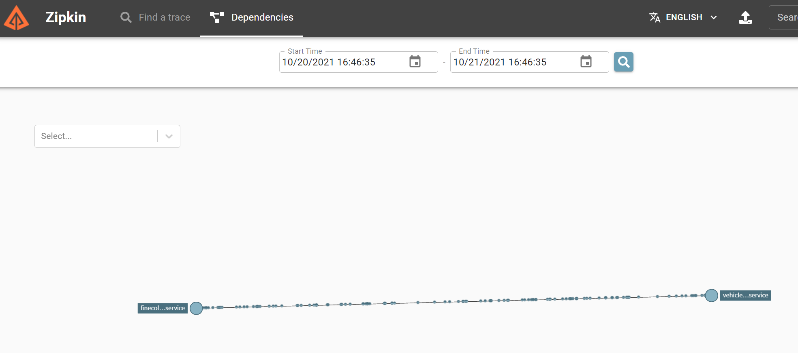

# Dapr service invocation and state

## Sample application

We will use the dapr-workshop sample application to demonstrate how to use the Dapr service invocation and state APIs. The Dapr workshop was held at DaprCon 2021 and goes beyond a simple "Hello World" example. Please see https://github.com/edwinvw/dapr-workshop for more details.

The workshop is available for .NET, Python and Java. We will use the .NET sample application for this tutorial. It can be found here:

https://github.com/EdwinVW/dapr-workshop-csharp

> We will not do the entire workshop but I do recommend going through the entire workshop to learn more about Dapr after this course is finished.

Make sure you have the following prerequisites:
- Dapr installed locally
- .NET 5 SDK installed locally
- Visual Studio Code with C# extension installed
- VS Code HTTP Client Extension installed (to use the .http files to test endpoints)

Now clone the repository to your local machine:

`git clone https://github.com/EdwinVW/dapr-workshop-csharp.git`

Now follow the step-by-step instructions to run the application at https://github.com/EdwinVW/dapr-workshop/blob/main/Assignment01/step-by-step.md. Use `Open in Integrated Terminal` on each folder and use `dotnet run` to run the services:
- run the VehicleRegistration service: provides information based on license plate
- run the FineCollection service: sends speeding tickets (requires the VehicleRegistration service)
- run the TrafficControl service: checks for violations
- run Simulation: simulates cars passing the traffic control system

Note that all services are running without Dapr. You just used `dotnet run` to run the services, each on their own HTTP port. In the next section, you will learn how easy it is to add Dapr to an existing app.

Before continuing, stop all services.

----------

## Adding Dapr service invocation

The FineCollection service calls the VehicleRegistration service to get vehicle information, before sending a fine. By adding Dapr to both services, we can use the Dapr service invocation API to obtain the vehicle information.

In the diagram below, (1) indicates the FineCollection service, calling the VehicleRegistration service via the sidecars:


The detailed instructions to add service invocation are here: https://github.com/EdwinVW/dapr-workshop/blob/main/Assignment02/step-by-step.md. We will NOT DO the step that uses the Dapr SDK for .NET.

In summary:
- you will run a Daprized version of the VehicleRegistration service **without** changing any code in the service; as long as your code has a HTTP handler for the `/vehicleinfo` endpoint, it will work.
- you will modify the FineCollection service to call the VehicleRegistration service via the sidecar.

Running a Daprized version of VehicleRegistration is easy. From the command line, in the folder of the vehicle registration service, run the following command:

`dapr run --app-id vehicleregistrationservice --app-port 6002 --dapr-http-port 3602 --dapr-grpc-port 60002 dotnet run`

**Note:** it is important to run all services on different Dapr HTTP and gRPC ports because they are all running on the same machine; with Kubernetes, these services run in their own pods so the same ports can be used. The --app-port above is the port your application uses.

To modify the FineCollection service, we will use the Dapr service invocation API. In the controller code, line 44 does the call to the Registration service with a proxy (code in the proxy does not use Dapr yet):

`var vehicleInfo = await _vehicleRegistrationService.GetVehicleInfo(speedingViolation.VehicleId);`

To invoke a service with Dapr, we use:

`http://localhost:<daprPort>/v1.0/invoke/<appId>/method/<method-name>`

To invoke the `vehicleinfo` method with Dapr, we will use:

`http://localhost:3601/v1.0/invoke/vehicleregistrationservice/method/vehicleinfo/{licenseNumber}`

Above:
- 3601 is the Dapr HTTP port for the FineCollection service (to be used later when we start the service with Dapr)
- vehicleregistrationservice is the Dapr app id for the VehicleRegistration service

Inside `Proxies/VehicleRegistrationService.cs` replace the code below:

```csharp
 public async Task<VehicleInfo> GetVehicleInfo(string licenseNumber)
    {
        return await _httpClient.GetFromJsonAsync<VehicleInfo>(
            $"http://localhost:6002/vehicleinfo/{licenseNumber}");
    }    
```

with the following:

```csharp
public async Task<VehicleInfo> GetVehicleInfo(string licenseNumber)
{
    return await _httpClient.GetFromJsonAsync<VehicleInfo>(
        $"http://localhost:3601/v1.0/invoke/vehicleregistrationservice/method/vehicleinfo/{licenseNumber}");
}
```

Now you can run `dotnet build` and run the service with Dapr:

`dapr run --app-id finecollectionservice --app-port 6001 --dapr-http-port 3601 --dapr-grpc-port 60001 dotnet run`

Now run the TrafficControl and the simulator services without Dapr (dotnet run).

You can use Zipkin to see activity (http://localhost:9411):



