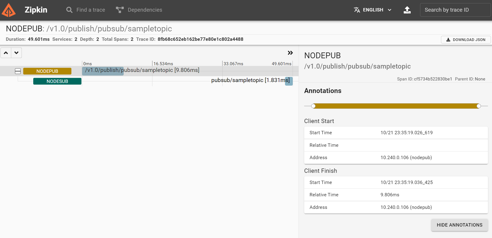

# Adding zipkin tracing

## Deploy Zipkin and expose the service

In the default namespace, do the following:

```
kubectl create deployment zipkin --image openzipkin/zipkin
kubectl expose deployment zipkin --type ClusterIP --port 9411
```

## Create a Dapr configuration

```yaml
apiVersion: dapr.io/v1alpha1
kind: Configuration
metadata:
  name: zipkin
  namespace: default
spec:
  tracing:
    samplingRate: "1"
    zipkin:
      endpointAddress: "http://zipkin.default.svc.cluster.local:9411/api/v2/spans"
```

## Configure sidecars

Tell the sidecars to use the zipkin tracing configuration:

```yaml
annotations:
  dapr.io/config: "zipkin"
```

## View tracing data

Use the following port forward:

```yaml
kubectl port-forward svc/zipkin 9412:9411
```

**Note:** local port 9412 because 9411 is used by local zipkin container

Result:

