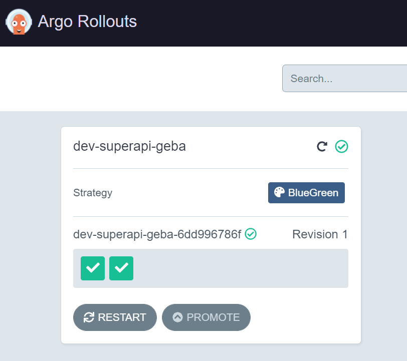
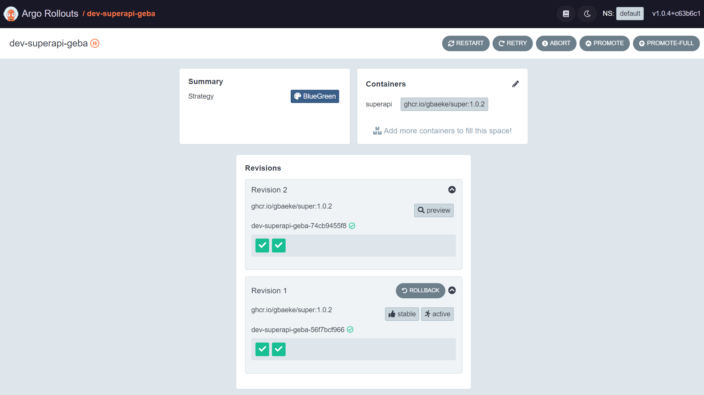

# Blue/Green with Argo Rollouts

## Install Argo Rollouts

```bash
kubectl create namespace argo-rollouts
kubectl apply -n argo-rollouts -f https://github.com/argoproj/argo-rollouts/releases/latest/download/install.yaml
```

Install the `kubectl` plugin:

```bash
brew install argoproj/tap/kubectl-argo-rollouts
```
The plugin allows you to interact with Argo Rollouts with the `kubectl argo rollouts` command.

💡 Tip: if you do not use brew, do a manual install: https://argoproj.github.io/argo-rollouts/installation/#manual 

## Optional: install kubeview

Run the following commands:

```bash
git clone https://github.com/benc-uk/kubeview.git
cd kubeview/charts
helm install kubeview ./kubeview
```

## Deploy a rollout

⚠️ IMPORTANT: Argo Rollouts uses custom resource definitions; you need to make Kustomize aware of them by including a configuration as described here: https://argoproj.github.io/argo-rollouts/features/kustomize/

To deploy our sample rollout, run the following command from the `manifests` folder:

```bash
kubectl apply -k .
```

The above command creates the following resources:
- One rollout: creates the initial ReplicaSet
- Two services:
    - active service: dev-superapi-svc-actice-geba (the prefix and suffix is applied correctly)
    - preview service: dev-superapi-svc-preview-geba (the prefix and suffix is applied correctly)
- One ConfigMap: dev-superapi-config-geba (correctly created by the ConfigMap generator)

In KubeView:


You can now use the following command to view the dashboard:

```
kubectl argo rollouts dashboard
```

Your rollout should look like below (http://localhost:3100):



## Make a change to the rollout

Modify `kustomization.yaml` with new values for the ConfigMap. In the `configMapGenerator`, set the WELCOME message to a different value and run `k apply -k .` again. This modifies the name of the ConfigMap with a new hash value and causes the pod template to change.

The above change results in a **2nd revision** of the rollout. It will be visible in the Argo Rollouts UI. When you click on the rollout, you will see the following:



Note that we did not change the image of the application. We only changed the WELCOME message via a ConfigMap generator.

To do a simple test, we can do the following:
- port forward to the active service on port 8080 and use `curl http://localhost:8080`; this will show `Hello from blue!`
- port forward to the preview service on port 8081 and use `curl http://localhost:8081`; this will show `Hello from green!`

## Promote the new version

When you are satisfied with the result, you can promote the new version from the UI with the `PROMOTE` or `PROMOTE-FULL` button. A full promotion skips analysis and pauses. We have not defined analysis steps or pauses. In our case, you can use either button.

Instead of the UI, you can use the CLI:

```
kubectl argo rollouts promote ROLLOUTNAME --full
```

When you now curl the active service (Revision 2), you should see `Hello from green!`. The previous ReplicaSet (Revision 1) will be scaled down. Both the active and preview services now point to the pods of the promoted rollout.

## Rolling back

Revision 2 should now be active. Revision 1 is still available and you have the option to rollback to it. From the UI, you can simply push the `ROLLBACK` button.

With the CLI:

```
kubectl argo rollouts undo dev-superapi-geba
```

This will have the following result:
- Revision 2 stays active and returns `Hello from green`; this is still the stable release
- There is a new revision (3) that returns `Hello from blue`; this is the preview now

Effectively, Argo Rollouts allows you to inspect the preview before calling `promote` on that. Now you can promote the rollout, which results in:
- Revision 2 scaled down
- Revision 3 is promoted to active and returns `Hello from blue`

