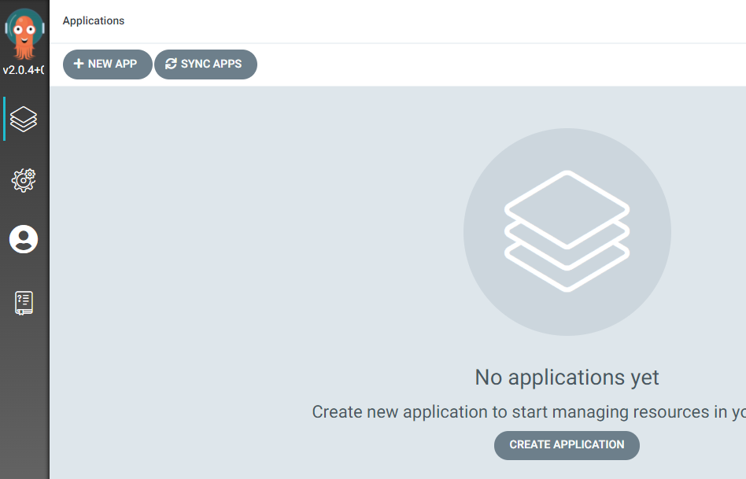
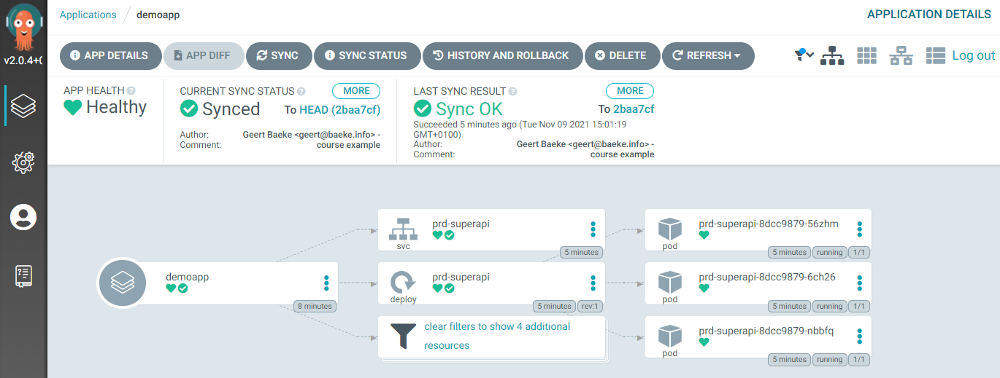

# Argo CD UI

## CLI

Before we use the UI, also install the CLI:

```
brew install argocd
```

If you do not use brew, see https://argo-cd.readthedocs.io/en/stable/cli_installation/

To access the API server with the CLI, do one of the following:
- use LoadBalancer IP address: `kubectl patch svc argocd-server -n argocd -p '{"spec": {"type": "LoadBalancer"}}'`
- port forward: `kubectl port-forward svc/argocd-server -n argocd 8080:443`

Using the latter option, the API server can be accessed via `http://localhost:8080`

Before we can login, retrieve the generated admin account password:

```
kubectl -n argocd get secret argocd-initial-admin-secret -o jsonpath="{.data.password}" | base64 -d
```

Delete the secret once you have retrieved the password!

Now login with the CLI and update the password:

```
argocd login localhost:8080
argocd account update-password
```

## Login to the UI

Using the `admin` account and the updated password, use your browser to navigate to `https://localhost:8080`. You should see the following:



In `Settings`, there is a `Clusters` section. It should contain the cluster Argo CD is running on. The list of applications is currently empty.

## Deploy a sample application

We will use the manifests in https://github.com/gbaeke/argo-demo/tree/master/course to deploy a sample application. The deployment uses kustomize base and overlays.

**⚠️ Important:** fork the repository and use the forked repo URL in the next steps.

Follow these steps in the UI:
- In `Applications` click `NEW APP`
- Enter an application name and use the default project
- Set the `SYNC POLICY` to `Manual`
- In the `SOURCE` section, enter the repository URL `https://github.com/gbaeke/argo-demo` and specify `course/overlays/prod` as path
- In `DESTINATION` select the internal cluster URL `https://kubernetes.default.svc` and leave the `NAMESPACE` empty
- Click `CREATE`

The app should now be visible, with a `SYNC` button to manually trigger a sync.

Click the `SYNC` button. In the UI, you can see the resources that will be synchronized:
- namespace
- service
- deployment

Click  `SYNCRONIZE`. The following resources will be created:
- namespace `superapi-prd`
- three pods with name `prd-superapi-...`
- service `prd-superapi

Click on the application to see details:



## Making a change

Modify `kustomization.yaml` in `course/overlays/prod` to have 5 replicas. Re-sync the application from the UI that shows the app details. You should now see 5 pods.

## Revert

You can use `HISTORY AND ROLLBACK` in Argo CD to revert the changes. From that point in time, the application will be back to the previous state but will show as `OutOfSync` with the git repo. If you click `SYNC` again, you will see 5 pods again.

You can of course revert at the git level and sync the app.

## Useful views in the UI

You can:
- use the tree view to see the details of the app (all K8S resources; filters can be applied)
- use the pods view and group by node, parent resource (replicaSet) and top level resource (deployment)
- use the network view to see the service and pods it routes to
