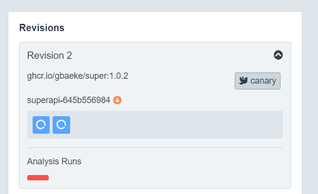

# Canary with Analysis

This folder contains an example of a canary release with an `AnalysisTemplate`. The template is used to start a job that returns a non-zero exit code on purpose. Here is the template:

```yaml
apiVersion: argoproj.io/v1alpha1
kind: AnalysisTemplate
metadata:
  name: test-canary
spec:
  metrics:
  - name: test-superapi
    interval: 5s
    failureLimit: 1
    provider:
      job:
        spec:
          backoffLimit: 0
          template:
            spec:
              containers:
              - name: test
                image: alpine:3.8
                command: [sh, -c]
                args: [exit 1]
              restartPolicy: Never
```

Notice that the provider is job. There are other providers such as Datadog and Prometheus, that can be used to evaluate metrics.

With the job provider, you can provide a job spec. In this case, the job uses `alpine:3.8` and just starts a shell (sh) with the -c option to then run the `exit` command.

In the rollout, we need to specify that we want to use this template (only the strategy is shown here):

```yaml
strategy:
    canary:
        canaryService: superapi-canary
        stableService: superapi-stable
        trafficRouting:
        smi:
            rootService: superapi-svc
            trafficSplitName: superapi-split
        analysis:
            templates:
            - templateName: test-canary
```

Note that it is possible to have steps as well and run the analysis at a specific step with `startingStep: <NUMBER>`. For example, if you have the following steps:

```yaml
steps:
    - setWeight: 20
    - pause: {duration: 10m}
    - setWeight: 40
    - pause: {duration: 10m}
    - setWeight: 60
    - pause: {duration: 10m}
    - setWeight: 80
    - pause: {duration: 10m}
```

You can run the analysis from the moment weight is set to 40 by adding `startingStep: 2`.

When analysis fails, the UI shows:



The UI will keep revision 2 fully scaled down, with the red analysis marker.

To see what happens when the analysis succeeds, modify the template to return exit code 0 and run `kubectl apply -f analysis-job.yaml`. Next, modify `kustomization.yaml` to modify the WELCOME message and run `kubectl apply -k .`. The rollout will deploy the new version, the anlysis will succeed and the new deployment becomes the stable version.