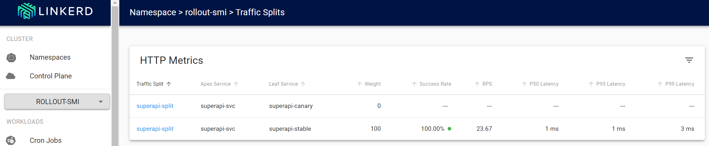

# Canary with SMI TrafficSplit

## Install Linkerd

Install the CLI with `brew install linkerd` or `curl -fsL https://run.linkerd.io/install | sh`

Run `linkerd check --pre` to validate your Kubernetes cluster.

Install linkerd with `linkerd install | kubectl apply -f -` and then run `linkerd check` to check if it worked.

💡 Tip: if `linkerd check` fails, try to delete the linkerd pods

Install the `viz` extension with `linkerd viz install | kubectl apply -f -`. Make sure you have enough resources to run the extension. It installs Prometheus, Grafana, and a dashboard.

To run the dashboard, run `linkerd viz dashboard`

## Install the application

From the `manifests-smi` folder, run `kubectl apply -k .` This does the following:
- create the rollout
- create both the canary and stable service
    - they both point to the same pods
- create a resource of type TrafficSplit with name `superapi`

The TrafficSplit resource will have the following in the spec:

```yaml
spec:
  backends:
  - service: superapi-canary
    weight: "0"
  - service: superapi-stable
    weight: "100"
  service: superapi-stable
```

This indicates that the stable service now gets 100% of traffic.

## Introduce a change

Modify the ConfigMap generator in `kustomization.yaml` to use another WELCOME message and run `kubectl apply -k .` again.

This does the following:
- Revision 1 is the stable service; this is the initial deployment
- Revision 2 has been added and is the canary
- The TrafficSplit resource is updated to point to the canary for 10% of the traffic; stable gets 90%

How to verify the traffic split?
- Use `kubectl apply -f debug-pod.yaml`: this pod also has the linkerd proxy injected
- Use `kubectl exec -it -c debug debug -- sh` to get a shell to the debug container in the debug pod
- Run `while true; do curl http://superapi-svc; done`: you will see mostly `Hello from v1` responses

If you run `linkerd viz dashboard` and find the Traffic Split in the `rollout-smi` namespace, you should see the split with the RPS (requests per second) of the canary at roughly 10% of the RPS of the stable service.

Now keep the while loop running and promote the canary. You should see the traffic split sending 100% of traffic to the stable service. The output from the while loop should all be `Hello from v2!`

Here is a screenshot of the traffic split:

